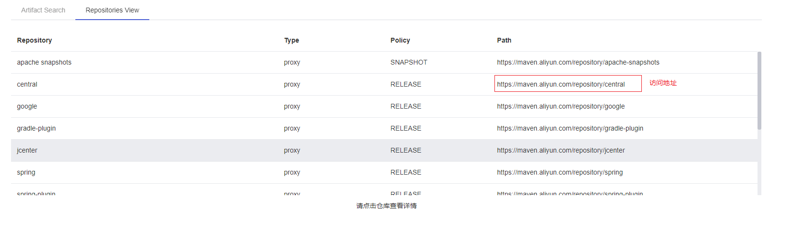
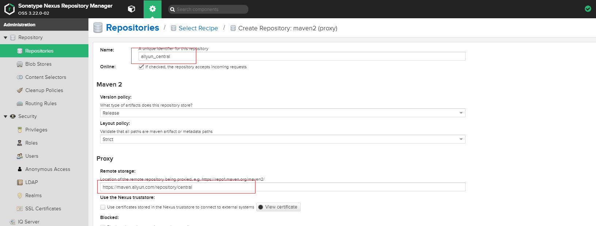
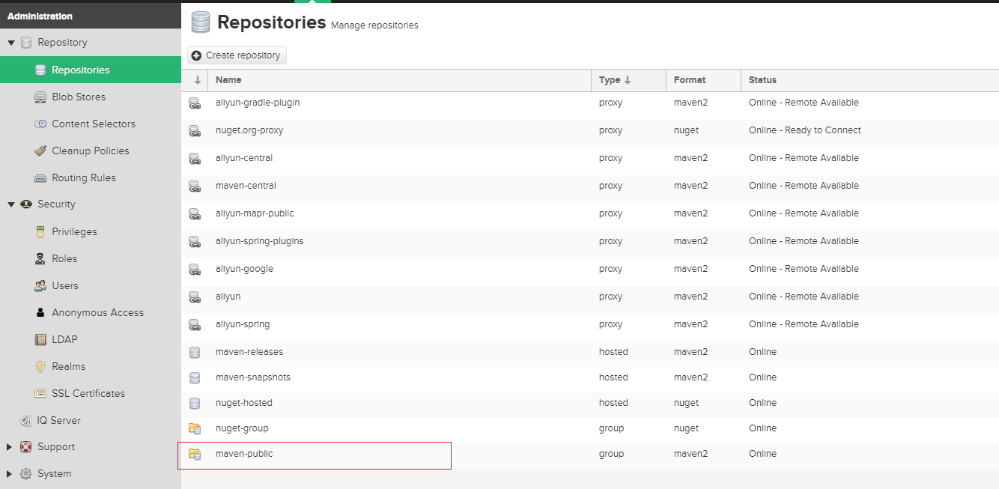

## 使用Docker启动Nexus3

------

## 1.简介

通常情况下，使用Maven管理Java项目的时候需要配置一个公司内的Maven镜像仓库。

因为，很多Jar包只能保存在公司内的服务器，不能传送到互联网上。

本文档主要说明如何创建一个公司内可用的Maven镜像仓库。

本文档只用Nexus3服务搭建Maven镜像仓库。


## 2.启动服务

本文档主要说明使用Docker启动Nexus3服务。

Docker的启动命令为：

```bash
#!/bin/bash

case "$1" in
        "start")
                docker run \
                       --name nexus3 \
                       -p 8081:8081 \
                       --name nexus \
                       -v /var/lib/maven:/nexus-data \
                       -d sonatype/nexus3
                ;;
        "stop")
                docker stop nexus3
                ;;
        "destroy")
                docker rm -f nexus3
                ;;
        *)
                echo "Usage: $@ [start|stop|destroy]"
esac


```


## 3.仓库配置


### 3.1.登录nexus3服务web页面


通过Docker启动Nexus3服务后可以使用Linux系统的命令查看8081端口是否启动成功。

```bash
$ ss -tnpl |grep 8081
```
如果可以看到8081端口就可以访问nexus3服务了。

### 3.2.修改管理员密码

nexus3默认用户名和密码是admin/admin123。登录后重新修改管理员密码。

### 3.3.仓库类型

nexus3服务可以设置的仓库类型有三种，依次是：

1. proxy：是远程仓库的代理。比如说在nexus中配置了一个central repository的proxy，当用户向这个proxy请求一个artifact，这个proxy就会先在本地查找，如果找不到的话，就会从远程仓库下载，然后返回给用户，相当于起到一个中转的作用。　　　　
1. Hosted：是宿主仓库，用户可以把自己的一些构件，deploy到hosted中，也可以手工上传构件到hosted里。比如说oracle的驱动程序，ojdbc6.jar，在central repository是获取不到的，就需要手工上传到hosted里，一般用来存放公司自己的jar包；
1. Group：是仓库组，在maven里没有这个概念，是nexus特有的。目的是将上述多个仓库聚合，对用户暴露统一的地址，这样用户就不需要在pom中配置多个地址，只要统一配置group的地址就可以了右边那个Repository Path可以点击进去，看到仓库中artifact列表。不过要注意浏览器缓存，当你的项目希望在多个。


通常我们使用maven的时候可以不用设置多个仓库地址，可以使用Group仓库类型管理多个仓库。

而通用的仓库主要有如下三个：

1. maven-public：maven-central、maven-release和maven-snapshot三个库的合集。
1. maven-release：用来存放release版本的jar包。
1. maven-snapshot：用来存放snapshot版本的jar包。


### 3.4.添加阿里云镜像仓库

nexus3服务启动后，默认会去国外的网站访问maven官方仓库。这样会导致我们初次下载某些软件依赖包的时候速度非常缓慢，好在有友好的阿里云帮助我们已经做好的常用仓库的镜像，我们需要把nexus3服务的仓库设置成阿里云提供的仓库。

### 3.4.1. 阿里云maven镜像仓库简介

可以通过如下地址访问阿里云的Maven镜像服务

```html
https://maven.aliyun.com/mvn/view
```

通过查看这个页面的最后一列，我们可以找到对应仓库在阿里云的访问地址。例如：




### 3.4.2. 把阿里云地址加入到私有仓库中

首先创建一个新的仓库，仓库类型为Proxy，填入地址，其他默认即可




最后选择“Create repository”按钮即可创建好一个类型为proxy的代理仓库。当用户访问这个代理仓库的时候如果本地有缓存就直接返回给客户，如果没有就需要再从阿里云拉去数据后再返回。


### 3.4.3. 修改maven-public仓库

因为这个仓库是一个group类型的仓库，以后客户端就可以通过访问这个仓库直接访问到后端的多个仓库管理的软件包。



把自己创建的阿里云代理仓库以导maven-public仓库中


到此为止，就可以访问我们的镜像仓库了。

## 4.修改settings.xml配置文件

通常修改好的settings.xml内容如下所示：

```xml
<?xml version="1.0" encoding="UTF-8"?>

<settings xmlns="http://maven.apache.org/SETTINGS/1.0.0"
          xmlns:xsi="http://www.w3.org/2001/XMLSchema-instance"
          xsi:schemaLocation="http://maven.apache.org/SETTINGS/1.0.0 http://maven.apache.org/xsd/settings-1.0.0.xsd">
  <localRepository>C:\Users\iXing\.m2\repository</localRepository>
  <servers>
    <server>
	    <id>nexus-releases</id>
	    <username>admin</username>
	    <password>admin</password>
    </server>
    <server>
	    <id>nexus-snapshots</id>
	    <username>admin</username>
    	<password>admin</password>
    </server>
    <server>
	    <id>3rdParty</id>
	    <username>admin</username>
	    <password>admin</password>
    </server>
  </servers>

  <mirrors>
    <mirror>
        <id>nexus</id>
        <name>nexus Mirror chenshu repository</name>
        <url>http://127.0.0.1:8081/repository/maven-public/</url>
        <mirrorOf>*</mirrorOf>
    </mirror>
    <mirror>
        <id>nexus</id>
        <name>nexus Mirror central repository</name>
        <url>http://127.0.0.1:8081/repository/aliyun-central/</url>
        <mirrorOf>*</mirrorOf>
    </mirror>
    <mirror>
        <id>3rdParty</id>
        <name>3rd party repository</name>
        <url>http://127.0.0.1:8081/repository/3rdParty/</url>
        <mirrorOf>3rdParty</mirrorOf>
    </mirror>
  </mirrors>

  <profiles>
    <profile>
      <id>jdk-1.8</id>

      <activation>
        <jdk>1.8</jdk>
      </activation>

	<properties>
		<maven.compiler.source>1.8</maven.compiler.source>
		<maven.compiler.target>1.8</maven.compiler.target>
		<maven.compiler.compilerVersion>1.8</maven.compiler.compilerVersion>
	</properties>
	<repositories>
		<repository>
			<id>maven-public</id>
			<url>http://127.0.0.1:8081/repository/maven-public/</url>
			<releases>
				<enabled>true</enabled>
			</releases>
			<snapshots>
				<enabled>true</enabled>
				<updatePolicy>always</updatePolicy>
			</snapshots>
		</repository>
		<repository>
			<id>aliyun-central</id>
			<url>http://127.0.0.1:8081/repository/aliyun-central/</url>
			<releases>
				<enabled>true</enabled>
			</releases>
			<snapshots>
				<enabled>true</enabled>
				<updatePolicy>always</updatePolicy>
			</snapshots>
		</repository>

		<repository>
			<id>3rdParty</id>
			<url>http://127.0.0.1:8081/repository/3rdParty/</url>
			<releases>
				<enabled>true</enabled>
			</releases>
			<snapshots>
				<enabled>true</enabled>
				<updatePolicy>always</updatePolicy>
			</snapshots>
		</repository>
	</repositories>

    </profile>

<profile>
	<id>jdk1.8</id>
	<activation>
	<activeByDefault>true</activeByDefault>
	<jdk>1.8</jdk>
	</activation>
	<properties>
		<maven.compiler.source>1.8</maven.compiler.source>
		<maven.compiler.target>1.8</maven.compiler.target>
		<maven.compiler.compilerVersion>1.8</maven.compiler.compilerVersion>
	</properties>
	<repositories>
		<repository>
			<id>maven-public</id>
			<url>http://127.0.0.1:8081/repository/maven-public/</url>
			<releases>
				<enabled>true</enabled>
			</releases>
			<snapshots>
				<enabled>true</enabled>
				<updatePolicy>always</updatePolicy>
			</snapshots>
		</repository>
		<repository>
			<id>aliyun-central</id>
			<url>http://127.0.0.1:8081/repository/aliyun-central/</url>
			<releases>
				<enabled>true</enabled>
			</releases>
			<snapshots>
				<enabled>true</enabled>
				<updatePolicy>always</updatePolicy>
			</snapshots>
		</repository>

		<repository>
			<id>3rdParty</id>
			<url>http://127.0.0.1:8081/repository/3rdParty/</url>
			<releases>
				<enabled>true</enabled>
			</releases>
			<snapshots>
				<enabled>true</enabled>
				<updatePolicy>always</updatePolicy>
			</snapshots>
			</repository>
		</repositories>
</profile>
  </profiles>
</settings>

```

