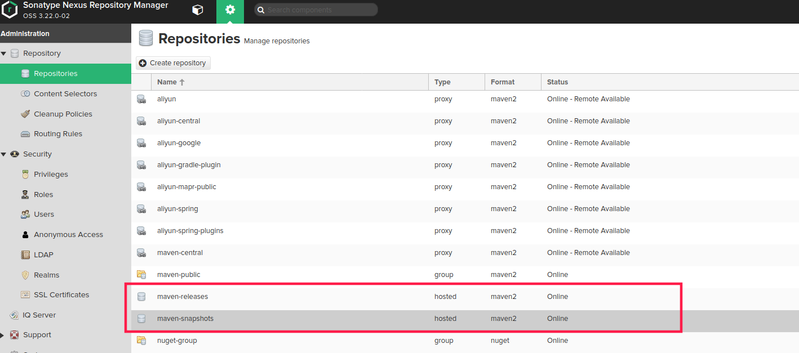

## 上传项目到私有仓库

通常一个项目编写并测试完成后，源代码需要推送到公司的git仓库，编译好的jar文件需要推送到公司的nexus3仓库中。

推送完成后才能被其他项目引用。

本文件主要说明的推送场景有两个：

1. 项目编译完成后推送场景。
1. 从第三方下载的jar文件推送场景。

## 1.确保私有仓库中有release和snapshot仓库

### 1.1.通常对release和snapshot仓库做如下区分：

Snapshot版本代表不稳定、尚处于开发中的版本  Release版本则代表稳定的版本 

1. mvn deploy到远程服务器的时候，如果推送到release仓库，则只能deploy一次。再次重复推送就会报不能更新的错误。
2. 但是如果推送到snapshot仓库的话，你可以deploy多次。每一次都会冲掉原来的版本。

### 1.2.什么情况下该用SNAPSHOT

协同开发的时候，如果模块A依赖模块B，而B会经常更新，则B应该使用SNAPSHOT来标识自己。

这种做法的必要性可以反证如下： 

1. 如果B不用SNAPSHOT，而是每次更新后都使用一个稳定的版本，那版本号就会升得太快，每天一升甚至每个小时一升，这就是对版本号的滥用。 
1. 如果B不用SNAPSHOT, 但一直使用一个单一的Release版本号，那当B更新后，A可能并不会接受到更新。因为A所使用的repository一般不会频繁更新release版本的缓存（即本地repository)，所以B以不换版本号的方式更新后，A在拿B时发现本地已有这个版本，就不会去远程Repository下载最新的B 

### 1.3.不用Release版本，在所有地方都用SNAPSHOT版本行不行？      

不行。正式环境中不得使用snapshot版本的库。 

比如说，今天你依赖某个snapshot版本的第三方库成功构建了自己的应用，明天再构建时可能就会失败，因为今晚第三方可能已经更新了它的snapshot库。
你再次构建时，Maven会去远程repository下载snapshot的最新版本，你构建时用的库就是新的jar文件了，这时正确性就很难保证了。

以上内容拷贝自： 
```html
https://www.cnblogs.com/aspirant/p/8532936.html
```

### 1.4.确认私有仓库中是否存在release和snapshot仓库

通过浏览器访问nexus3的管理页面，如果可以看到类似一下截图的仓库，证明存在release和snapshot仓库




## 2.修改pom.xml文件

在个人项目中的pom.xml文件中添加部署仓库的配置。

```xml
 <distributionManagement>
        <!-- use the following if you're not using a snapshot version. -->
        <repository>
            <id>releases</id>
            <url>http://172.18.9.250:8081/repository/maven-releases/</url>
        </repository>
        <!-- use the following if you ARE using a snapshot version. -->
        <snapshotRepository>
            <id>snapshots</id>
            <url>http://172.18.9.250:8081/repository/maven-snapshots/</url>
        </snapshotRepository>
    </distributionManagement>
```

## 3.尝试推送项目到私有仓库

可以使用mvn deploy命令把编译好的jar文件推送到远程私有仓库

这里以flink-shade-7.0项目为例，我要把他推送到私有的release仓库，则可以使用如下命令。

```bash
$ mvn clean deploy -Dhadoop.version=2.7.7 -DskipTests -Drat.skip=true -P release
```

## 4.尝试把本地下载好的jar文件推送到私有仓库

有的时候可能某些以来无法从maven仓库中下载，需要去制定的地址下载下来后再推送到私有的maven仓库。

比如在编译flink的时候可能会碰到找不到kafka-schema-registry-client-3.3.1.jar包的情况，这时就需要手工下载这个包然后上传到私有仓库供编译flink使用。

方法如下：

下载某个包

```bash
wget http://packages.confluent.io/maven/io/confluent/kafka-schema-registry-client/3.3.1/kafka-schema-registry-client-3.3.1.jar
```


把下载好的包推送到私有仓库

假设下载后保存的路径为/tmp/kafka-schema-registry-client-3.3.1.jar

```bash
mvn install:install-file -DgroupId=io.confluent -DartifactId=kafka-schema-registry-client -Dversion=3.3.1 -Dpackaging=jar -Dfile=/tmp/kafka-schema-registry-client-3.3.1.jar
```