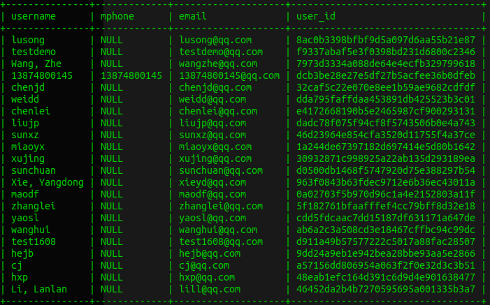

## 使用ProxySQL进行数据脱敏
-----

## 1.简介

数据脱敏是指对某些敏感信息通过脱敏规则进行数据的变形，实现敏感隐私数据的可靠保护。

在涉及客户安全数据或者一些商业性敏感数据的情况下，在不违反系统规则条件下，对真实数据进行改造并提供测试使用。

被脱敏的数据不限于以下几种：
1. 身份证号
1. 手机号
1. 卡号 
1. 客户号
1. 客户名称
1. 客户邮箱
1. 客户地址
1. **

数据脱敏数据安全技术之一，其他与数据安全的技术还包括：
1. 数据库漏扫
1. 数据库加密
1. 数据库防火墙
1. 数据脱敏
1. 数据库安全审计系统

通过多维度的数据安全策略，可以尽量避免 拖库、刷库、撞库等情况的发生。

本文主要讲述如何使用MySQL数据库代理软件ProxySQL的查询覆写和查询规则功能实现数据脱敏。


## 2.ProxySQL查询覆写和查询规则

ProxySQL是一款非常强大的数据库代理软件，他对DBA、开发和测试都非常友好。我对这款软件的评价就是：“早用早享受，谁用谁知道：）”

抛开其强大的在线不停机维护功能不谈，最让我喜欢的还有它提供了查询覆写和在线配置查询规则的能力。在日常数据库维护的时候查询覆写和在线配置查询规则能帮助我们在不修改任何代码的前提下快速优化线上SQL，快速调整后端数据库架构。当然还包括这篇文档中要着重说明的它可以按照我们配置的查询规则和覆写规则实现数据脱敏。

### 2.1.公司线上数据脱敏的要求

我所在的公司对线上数据安全性有一些要求，以下罗列出一些：

1. 对用户基本信息进行脱敏。用户基本信息包括：用户真实姓名、邮箱、手机号、家庭住址等。
1. 对用户的消费信息进行脱敏。包括：充值、消费等金额要脱敏
1. 对公司服务的组织名称要脱敏
1. 对于只读数据库要严格禁止的操作有
```txt
        DML： INSERT、UPDATE、DELETE、SELECT...JOIN...、SELECT *
        DDL： CREATE、DROP、ALTER、TRUNCATE
        ADMIN： SHOW、SET
```


## 3.实现方案

PrxoySQL是一款MySQL数据库代理软件，所有对后端数据库的请求都要通过它才能转发给后端数据库。而ProxySQL又支持进行查询覆写和查询规则配置。

在用户发起查询请求的时候，我们就可以通过ProxySQL提供的机制对SQL语句进行改写，在制定的列上加上不同的函数，进而实现数据脱敏的要求。

为了实现上面的设想，我们来深入的研究以下ProxySQL的查询规则配置。

本文档使用的ProxySQL版本为 2.0.10


### 3.1.ProxySQL查询规则

官方文档地址
```html
https://github.com/sysown/proxysql/wiki/Main-(runtime)#mysql_query_rules
```

当登录到ProxySQL的终端管理界面后，就可以执行如下命令查看到查询规则的配置表结构。

```sql
Admin> SHOW CREATE TABLE mysql_query_rules\G
*************************** 1. row ***************************
       table: mysql_query_rules
Create Table: CREATE TABLE mysql_query_rules (
    rule_id INTEGER PRIMARY KEY AUTOINCREMENT NOT NULL,
    查询规则id
    active INT CHECK (active IN (0,1)) NOT NULL DEFAULT 0,
    规则是否处于激活状态。只有actvie=1的时候这条规则才被加载到runtime模式，并且被查询规则处理器处理。
    username VARCHAR,
    发起查询的用户名
    schemaname VARCHAR,
    查询目标数据库名称
    flagIN INT CHECK (flagIN >= 0) NOT NULL DEFAULT 0,
    链式查询规则入口。当这个查询规则处于激活状态(active=1)，flagIN=0的时候就会从这条规则开始匹配语句。
    client_addr VARCHAR,
    发起查询规则的客户端地址
    proxy_addr VARCHAR,
    proxy_port INT CHECK (proxy_port >= 0 AND proxy_port <= 65535), 
    发起查询规则的代理的地址和端口。
    digest VARCHAR,
    查询的digest唯一编码，这个唯一编码可以通过以下语句获取。select * from stats.stats_mysql_query_digest，通过找到执行的语句就能找到对应的digest值。
    match_digest VARCHAR,
    同上。用在匹配digest的时候。一般用不到。
    match_pattern VARCHAR,
    这个就是进行数据脱敏非常重要的参数之一。这里需要配置一些正则表达式，通过正则表达式就能匹配到某个SQL语句。进而可以对匹配到的SQL语句进行查询覆写。
    negate_match_pattern INT CHECK (negate_match_pattern IN (0,1)) NOT NULL DEFAULT 0,
    表示这条语句是否进行取反匹配。比如match_pattern匹配到一个SQL，而此时negate_match_pattern的值设为1，则表示匹配这个SQL以外的所有SQL。
    re_modifiers VARCHAR DEFAULT 'CASELESS',
    正则匹配算法。默认即可。
    flagOUT INT CHECK (flagOUT >= 0), replace_pattern VARCHAR CHECK(CASE WHEN replace_pattern IS NULL THEN 1 WHEN replace_pattern IS NOT NULL AND match_pattern IS NOT NULL THEN 1 ELSE 0 END),
    这个又是链式匹配最终要的参数之一，flagOUT的值如果和它下面的某个规则flagIN的值一样，就会把处理的SQL再转发给这个规则处理。直到发送给某个apply的值为1的规则为止。
    destination_hostgroup INT DEFAULT NULL,
    目标后端mysql的编号，这个在mysql_servers表中配置
    cache_ttl INT CHECK(cache_ttl > 0),
    cache_empty_result INT CHECK (cache_empty_result IN (0,1)) DEFAULT NULL,
    cache_timeout INT CHECK(cache_timeout >= 0),
    与查询缓冲相关的配置，本文档用不到。
    reconnect INT CHECK (reconnect IN (0,1)) DEFAULT NULL,
    是否重连
    timeout INT UNSIGNED CHECK (timeout >= 0),
    查询超时时间
    retries INT CHECK (retries>=0 AND retries <=1000),】
    重试次数
    delay INT UNSIGNED CHECK (delay >=0),
    延时时间。本文档用不到
    next_query_flagIN INT UNSIGNED,
    mirror_flagOUT INT UNSIGNED,
    mirror_hostgroup INT UNSIGNED,
    对查询进行mirror操作的配置。本文档用不到。
    error_msg VARCHAR,
    对查询返回一个错误消息。在数据脱敏的时候可以有友好提示。
    OK_msg VARCHAR,
    对查询返回一个OK消息。本文档用不到。
    sticky_conn INT CHECK (sticky_conn IN (0,1)),
    是否更愿意连到某个后端
    multiplex INT CHECK (multiplex IN (0,1,2)),
    复杂查询配置。本文用不到
    gtid_from_hostgroup INT UNSIGNED,
    gtid配置。本文用不到
    log INT CHECK (log IN (0,1)),
    是否记录日志。如果log=1，还必须在variables中配置日志格式和路径。
    apply INT CHECK(apply IN (0,1)) NOT NULL DEFAULT 0,
    只有apply=1的时候，查询规则才被执行。通常普通的单条查询规则要把active、apply都设置为1；而链式查询规则入口规则的active都要为1，apply要为0，最后出口的规则active和apply必须都要为1。
    comment VARCHAR)
    规则注释
1 row in set (0.00 sec)
```

通过对需求的分析，可以得知需要用到的查询规则配置项为

1. rule_id
1. active
1. apply
1. match_pattern
1. replace_pattern
1. negate_match_pattern
1. flagIN
1. flagOUT
1. error_msg


## 4.实现过程

### 4.1.禁止DDL

我们常用的DDL操作有如CREATE、DROP、ALTER、TRUNCATE，下面就以这几个为例。通过配置ProxySQL的查询规则实现捕获并禁止这些DDL操作。

### 4.1.1.插入规则

首先，需要网mysql_query_rules表中插入新的配置规则

```sql
INSERT INTO mysql_query_rules(rule_id,active,apply,match_pattern,replace_pattern,negate_match_pattern,flagIN,flagOUT,error_msg) VALUES(1,1,1,'^TRUNCATE.*',NULL,0,0,0,'对不起，您的操作被禁止.保护公司数据安全人人有责!!!');
INSERT INTO mysql_query_rules(rule_id,active,apply,match_pattern,replace_pattern,negate_match_pattern,flagIN,flagOUT,error_msg) VALUES(2,1,1,'^CREATE.*',NULL,0,0,0,'对不起，您的操作被禁止.保护公司数据安全人人有责!!!');
INSERT INTO mysql_query_rules(rule_id,active,apply,match_pattern,replace_pattern,negate_match_pattern,flagIN,flagOUT,error_msg) VALUES(3,1,1,'^DROP.*',NULL,0,0,0,'对不起，您的操作被禁止.保护公司数据安全人人有责!!!');
INSERT INTO mysql_query_rules(rule_id,active,apply,match_pattern,replace_pattern,negate_match_pattern,flagIN,flagOUT,error_msg) VALUES(4,1,1,'^ALTER.*',NULL,0,0,0,'对不起，您的操作被禁止.保护公司数据安全人人有责!!!');
```

### 4.1.2.使规则生效

插入完成后需要使新插入的规则生效，执行如下语句

```sql
LOAD MYSQL QUERY RULES TO RUNTIME;
SAVE MYSQL QUERY RULES TO DISK;
```

### 4.1.3.验证规则

通过mysql客户端连到代理访问后面的数据库

```bash
mysql -h 127.0.0.1 -udev -pdev -P6033
```


执行一些命令

```sql
mysql> create table t1(a1 varchar(255));
ERROR 1148 (42000): 对不起，您的操作被禁止.保护公司数据安全人人有责!!!
mysql> truncate table t1;
ERROR 1148 (42000): 对不起，您的操作被禁止.保护公司数据安全人人有责!!!
mysql> drop table t1;
ERROR 1148 (42000): 对不起，您的操作被禁止.保护公司数据安全人人有责!!!
mysql> alter table t1 add column a2 varchar(255);
ERROR 1148 (42000): 对不起，您的操作被禁止.保护公司数据安全人人有责!!!
```

### 4.2.禁止SELECT *操作

通常作为DBA是不推荐代码中包含SELECT *操作的，我们主张用谁就取谁，而实际情况却通常不是如此。

在一个只读数据库上，因为要与真正的人交互，就不能把权限放的太大。所以命令禁止这种操作的发生。而从只读上杜绝很不好控制，那就在数据库这端用技术限制。

### 4.2.1.插入规则

```sql
INSERT INTO mysql_query_rules(rule_id,active,apply,match_pattern,replace_pattern,negate_match_pattern,flagIN,flagOUT,error_msg) VALUES(5,1,1,'^SELECT \*',NULL,0,0,0,'对不起，您的操作被禁止.保护公司数据安全人人有责!!!');
```

### 4.2.2.使规则生效

插入完成后需要使新插入的规则生效，执行如下语句

```sql
LOAD MYSQL QUERY RULES TO RUNTIME;
SAVE MYSQL QUERY RULES TO DISK;
```

### 4.2.3.验证规则

```sql
mysql> select * from t1;
ERROR 1148 (42000): 对不起，您的操作被禁止.保护公司数据安全人人有责!!!
```

### 4.3.禁止部分DML操作

有的操作在只读数据库上是明令禁止的，虽然我们会为只读库的用户分配只读权限。但是为了保险，我们可以在代理层也加上一层限制。防止数据被恶意修改。

### 4.3.1.插入规则

```sql
INSERT INTO mysql_query_rules(rule_id,active,apply,match_pattern,replace_pattern,negate_match_pattern,flagIN,flagOUT,error_msg) VALUES(6,1,1,'^DELETE.*',NULL,0,0,0,'对不起，您的操作被禁止.保护公司数据安全人人有责!!!');
INSERT INTO mysql_query_rules(rule_id,active,apply,match_pattern,replace_pattern,negate_match_pattern,flagIN,flagOUT,error_msg) VALUES(7,1,1,'^UPDATE.*',NULL,0,0,0,'对不起，您的操作被禁止.保护公司数据安全人人有责!!!');
INSERT INTO mysql_query_rules(rule_id,active,apply,match_pattern,replace_pattern,negate_match_pattern,flagIN,flagOUT,error_msg) VALUES(8,1,1,'^INSERT.*',NULL,0,0,0,'对不起，您的操作被禁止.保护公司数据安全人人有责!!!');
```

### 4.3.2.使规则生效


插入完成后需要使新插入的规则生效，执行如下语句

```sql
LOAD MYSQL QUERY RULES TO RUNTIME;
SAVE MYSQL QUERY RULES TO DISK;
```

### 4.3.3.验证规则

```sql
mysql> insert into t1(a1) values('a');
ERROR 1148 (42000): 对不起，您的操作被禁止.保护公司数据安全人人有责!!!
mysql> delete from t1;
ERROR 1148 (42000): 对不起，您的操作被禁止.保护公司数据安全人人有责!!!
mysql> update t1 set a1 = 'b' where a1 = 'a';
ERROR 1148 (42000): 对不起，您的操作被禁止.保护公司数据安全人人有责!!!
```

### 4.4.禁止联合查询操作

因为我们要面对的操作非常多，而联合查询等复杂一点的查询更不好控制。

为了降低数据泄露的风险，需要禁止联合查询等复杂查询。

### 4.4.1.插入规则

```sql
INSERT INTO mysql_query_rules(rule_id,active,apply,match_pattern,replace_pattern,negate_match_pattern,flagIN,flagOUT,error_msg) VALUES(9,1,1,'(.*) JOIN (.*)',NULL,0,0,0,'对不起，您的操作被禁止.保护公司数据安全人人有责!!!');
```

### 4.4.2.使规则生效

插入完成后需要使新插入的规则生效，执行如下语句

```sql
LOAD MYSQL QUERY RULES TO RUNTIME;
SAVE MYSQL QUERY RULES TO DISK;
```

### 4.4.3.验证规则

```sql
mysql> select * from t1 left join t2 on t1.a1 = t2.a1;
ERROR 1148 (42000): 对不起，您的操作被禁止.保护公司数据安全人人有责!!!
```

### 4.5.禁止管理命令

有的环境我们禁止使用SHOW开头的命令，防止数据库配置、数据库运行进程被泄露。

### 4.5.1.插入规则

```sql
INSERT INTO mysql_query_rules(rule_id,active,apply,match_pattern,replace_pattern,negate_match_pattern,flagIN,flagOUT,error_msg) VALUES(10,1,1,'^SHOW.*',NULL,0,0,0,'对不起，您的操作被禁止.保护公司数据安全人人有责!!!');
INSERT INTO mysql_query_rules(rule_id,active,apply,match_pattern,replace_pattern,negate_match_pattern,flagIN,flagOUT,error_msg) VALUES(11,1,1,'^SET.*',NULL,0,0,0,'对不起，您的操作被禁止.保护公司数据安全人人有责!!!');
```

### 4.5.2.使规则生效


插入完成后需要使新插入的规则生效，执行如下语句

```sql
LOAD MYSQL QUERY RULES TO RUNTIME;
SAVE MYSQL QUERY RULES TO DISK;
```

### 4.5.3.验证规则

```sql
mysql> set global wait_timeout = 28800;
ERROR 1148 (42000): 对不起，您的操作被禁止.保护公司数据安全人人有责!!!
mysql> show processlist;
ERROR 1148 (42000): 对不起，您的操作被禁止.保护公司数据安全人人有责!!!
```

## 5.SQL覆写

SQL覆写是本文档重点内容。通过覆写和链式查询规则，我们可以实现从简单到复杂的数据脱敏效果。

### 5.1.限制返回行数

通常我们查询的数据会有很多行，使用数据库的人想返回多少行我们是无法从只读上限制的。

而在MySQL数据库中可以通过LIMIT限制返回行数，我们就可以通过ProxySQL的查询覆写功能把所有合法的查询语句末尾都加上一个LIMIT子句，这样就能满足限制行数的需求

### 5.1.1.插入规则

```sql
INSERT INTO mysql_query_rules(rule_id,active,apply,match_pattern,replace_pattern,negate_match_pattern,flagIN,flagOUT,error_msg) VALUES(100,1,1,'^SELECT (.*) (.*)',"SELECT \1 \2 LIMIT 10",0,100,100,NULL)
```

### 5.1.2.是规则生效


插入完成后需要使新插入的规则生效，执行如下语句

```sql
LOAD MYSQL QUERY RULES TO RUNTIME;
SAVE MYSQL QUERY RULES TO DISK;
```

### 5.1.3.验证规则

```sql
mysql> select object_id,object_repr from django_admin_log;
+-----------+----------------------------------------------------+
| object_id | object_repr                                        |
+-----------+----------------------------------------------------+
| 5         | 10 12 * 11 7 (m/h/d/dM/MY)                         |
| 8         | fetch_daily_job_manual: 10 12 * 11 7 (m/h/d/dM/MY) |
| 8         | fetch_daily_job_manual: 10 12 * 11 7 (m/h/d/dM/MY) |
| 8         | fetch_daily_job_manual: 10 12 * 11 7 (m/h/d/dM/MY) |
| 5         | 22 13 * 11 7 (m/h/d/dM/MY)                         |
| 8         | fetch_daily_job_manual: 22 13 * 11 7 (m/h/d/dM/MY) |
| 5         | 33 13 * 11 7 (m/h/d/dM/MY)                         |
| 5         | 5 15 * 11 7 (m/h/d/dM/MY)                          |
| 5         | 37 15 * 11 7 (m/h/d/dM/MY)                         |
| 8         | fetch_daily_job_manual: 37 15 * 11 7 (m/h/d/dM/MY) |
+-----------+----------------------------------------------------+
10 rows in set (0.00 sec)
```
所有查询默认就只能返回10条数据


### 5.2.脱敏一列数据

脱敏一列数据的意思是在一个查询语句中有一个列的数据需要脱敏，这种需求是最容易实现的。

假设当前数据库有一个t_user表，里面有一个email列需要脱敏。我们脱敏的规则是把email列@以前的字符算一个MD5值然后返回给客户端

t_user表的表结构如下所示：

```sql
CREATE TABLE `t_user` (
  `username` varchar(255) DEFAULT NULL,
  `mphone` varchar(255) DEFAULT NULL,
  `email` varchar(255) DEFAULT NULL,
  `user_id` varchar(255) DEFAULT NULL
) ENGINE=InnoDB DEFAULT CHARSET=utf8 
```

灌入一部分测试数据，我的待测试原始数据为




## 参考资料

参考链接：
```html
https://baike.baidu.com/item/%E6%95%B0%E6%8D%AE%E8%84%B1%E6%95%8F/7914656?fr=aladdin
```
