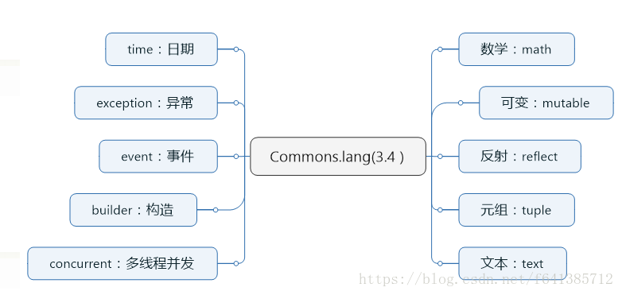
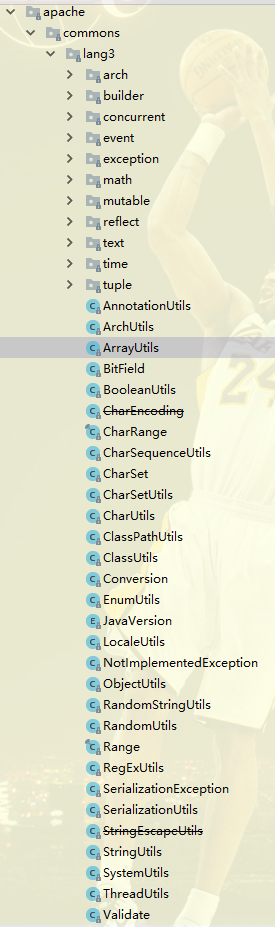

## Lang3

----

### 1. 简介

Lang3是Apache Commons团队发布的工具包。

Lang3要求JDK版本在1.5以上，相对于Lang来说完全支持Java5的新特性。

因为该版本无法兼容旧有版本，并且废除了一些旧API，为了避免冲突于是改名为Lang3。

### 2. Lang3包结构



### 3. Lang3包含的类如下



下面介绍常用的类及使用方法

### 3. ArrayUtils

用于对数组的操作，如添加、查找、删除、子数组、倒序、元素类型转换等

### 3.1. 初始化

它提供了8中基本数据类型以及包装类以及各种类型的长度为0的空数组。

所以以后需要长度为0的数组，可以不用new了，直接用这个即可

```java
public static final int[] EMPTY_INT_ARRAY = new int[0];
public static final Integer[] EMPTY_INTEGER_OBJECT_ARRAY = new Integer[0];
```

### 3.2. toString

功能基本同java自己的Arrays.toString方法

### 3.3. hashCode

相同个数、相同顺序的数组hashCode会是一样的

```java
 public static void main(String[] args) {
        Integer[] inArr = new Integer[]{1, 2, 3};
        Integer[] inArr2 = new Integer[]{1, 2, 3};
        System.out.println(ArrayUtils.hashCode(inArr)); //862547
        System.out.println(ArrayUtils.hashCode(inArr2)); //862547

        inArr = new Integer[]{1, 2, 3};
        inArr2 = new Integer[]{1, 3, 3};
        System.out.println(ArrayUtils.hashCode(inArr)); //862547
        System.out.println(ArrayUtils.hashCode(inArr2)); //862584
}
```

### 3.4. isEquals

该方法已经被废弃。取代的为java自己的java.util.Objects.deepEquals(Object, Object)

```java
public static void main(String[] args) {
        Integer[] inArr = new Integer[]{1, 2, 3};
        Integer[] inArr2 = new Integer[]{1, 2, 3};
        System.out.println(Objects.deepEquals(inArr, inArr2)); //true

        inArr = new Integer[]{1, 2, 3};
        inArr2 = new Integer[]{1, 3, 3};
        System.out.println(Objects.deepEquals(inArr, inArr2)); //false
}
```

### 3.5. toArray

可以简便的构建一个数组。但是注意下面的区别：

```java
Integer[] integers = ArrayUtils.toArray(1, 2, 3);
Serializable[] serializables = ArrayUtils.toArray(1, 2, "3");
```

### 3.6. nullToEmpty

将null转换为空的数组,如果数组不为null,返回原数组,如果数组为null,返回一个空的数组

### 3.7. toObject/toPrimitive

这两个方法很有用 可以实现比如int[]和Integer[]数组之间的互转

```java
Integer[] inArr = new Integer[]{1, 2, 3};
int[] ints = ArrayUtils.toPrimitive(inArr);
Integer[] integers = ArrayUtils.toObject(ints);
```

### 3.8. toStringArray

这个方法是将Object数组转换成String数组。

```java
public static void main(String[] args) {
        Integer[] inArr = new Integer[]{1, 2, 3};
        int[] ints = new int[]{1,2,3};
        String[] strings = ArrayUtils.toStringArray(inArr);
        //ArrayUtils.toStringArray(ints); //编译报错哟
}
```

需要注意：

```java
public static void main(String[] args) {
       Integer[] inArr = new Integer[]{1, 2, null};
       //String[] strings = ArrayUtils.toStringArray(inArr);
       
       //如果里面有null元素，会报错的，所以我们可以用下面这个方法 把null转成指定的值即可
       String[] strings = ArrayUtils.toStringArray(inArr,"");
       
}
```

### 3.9. getLength、isSameLength

有时候建议使用。因为它是对null安全的。null的length为0

### 4. CharEncoding

过时。被Java自己的java.nio.charset.StandardCharsets取代

### 5. CharUtils

用于操作char值和Character对象

toCharacterObjec/toChart：把char或者String转为一个Character对象。互转。Character,valueOf()很多时候也能达到这个效果
toIntValue：把char和Character转为对应的int值
isAscii系列：判断该字符是否是Ascii码


### 6. ClassPathUtils

处理类路径的一些工具类

toFullyQualifiedName(Class<?> context, String resourceName) 返回一个由class包名+resourceName拼接的字符串

```java
public static void main(String[] args) {
        String fullPath = ClassPathUtils.toFullyQualifiedName(Integer.class, "");
        System.out.println(fullPath); //java.lang.
        //fullPath = ClassPathUtils.toFullyQualifiedName(Integer.class.getPackage(), "Integer.value");
        fullPath = ClassPathUtils.toFullyQualifiedName(Integer.class, "Integer.value");
        System.out.println(fullPath); //java.lang.Integer.value
}
```

toFullyQualifiedName(Package context, String resourceName) 返回一个由class包名+resourceName拼接的字符串
toFullyQualifiedPath(Class<?> context, String resourceName) 返回一个由class包名+resourceName拼接的字符串
toFullyQualifiedPath(Package context, String resourceName) 返回一个由class包名+resourceName拼接的字符串

```java
ClassPathUtils.toFullyQualifiedPath(StringUtils.class, "StringUtils.properties") = "org/apache/commons/lang3/StringUtils.properties"
```


### 7. ClassUtils

用于对Java类的操作（有很多方法还是挺有用的）

getShortClassName：

```java
public static void main(String[] args) {
        System.out.println(int[].class.getSimpleName()); //int[]
        System.out.println(ClassUtils.getShortClassName(int[].class)); //int[]
        System.out.println(ClassUtils.getShortClassName(String.class)); //String
        System.out.println(ClassUtils.getShortClassName(ArrayList.class)); //ArrayList
        System.out.println(ClassUtils.getShortClassName("List")); //List
}
```

getPackageName：获取包名

```java
public static void main(String[] args) {
       System.out.println(ClassUtils.getPackageName(int[].class)); //""
       System.out.println(ClassUtils.getPackageName(String.class)); //java.lang
}
```

getAllSuperclasses：获取到该类的所有父类 注意：只是父类 不包含接口

```java
public static void main(String[] args) {
       List<Class<?>> allSuperclasses = ClassUtils.getAllSuperclasses(ArrayList.class);
       System.out.println(ArrayUtils.toString(allSuperclasses)); //[class java.util.AbstractList, class java.util.AbstractCollection, class java.lang.Object]
}

public static void main(String[] args) {
       List<Class<?>> allSuperclasses = ClassUtils.getAllSuperclasses(ArrayList.class);
       System.out.println(ArrayUtils.toString(allSuperclasses)); //[class java.util.AbstractList, class java.util.AbstractCollection, class java.lang.Object]
       allSuperclasses = ClassUtils.getAllSuperclasses(Object.class);
       System.out.println(ArrayUtils.toString(allSuperclasses)); //[]
}
```

getAllInterfaces：同上。但此方法指的是接口

convertClassNamesToClasses/convertClassesToClassNames 见名知意

```java
public static void main(String[] args) {
       List<Class<?>> classes = ClassUtils.convertClassNamesToClasses(Arrays.asList("java.lang.Integer","java.lang.int"));
       System.out.println(classes); //[class java.lang.Integer, null]
}
```


isPrimitiveOrWrapper、isPrimitiveWrapper 、primitiveToWrapper、primitivesToWrappers、wrapperToPrimitive判断是基本类型还是包装类型

```java
public static void main(String[] args) {
        System.out.println(ClassUtils.isPrimitiveOrWrapper(Integer.class)); //true
        System.out.println(ClassUtils.isPrimitiveOrWrapper(int.class)); //true

        //检测是否是包装类型
        System.out.println(ClassUtils.isPrimitiveWrapper(Object.class)); //false 注意 此处是false
        System.out.println(ClassUtils.isPrimitiveWrapper(Integer.class)); //true
        System.out.println(ClassUtils.isPrimitiveWrapper(int.class)); //false

        //检测是否是基本类型
        System.out.println(Object.class.isPrimitive()); //false 注意 此处也是false
        System.out.println(Integer.class.isPrimitive()); //false
        System.out.println(int.class.isPrimitive()); //true
    }
```


isAssignable：是否是相同的class类型 支持class、数组等等 挺实用的

isInnerClass：检查一个类是否是内部类或者静态内部类等

getClass：加强版的Class.forName() 可以指定值是否要马上初始化该类

hierarchy：获取到该类的继承结构

```java
public static void main(String[] args) {
        Iterable<Class<?>> hierarchy = ClassUtils.hierarchy(ArrayList.class);
        hierarchy.forEach(System.out::println);
        //输出了类的层级结构（默认是不包含接口的）
        //class java.util.ArrayList
        //class java.util.AbstractList
        //class java.util.AbstractCollection
        //class java.lang.Object
        hierarchy = ClassUtils.hierarchy(ArrayList.class,ClassUtils.Interfaces.INCLUDE);
        hierarchy.forEach(System.out::println);
        //class java.util.ArrayList
        //interface java.util.List
        //interface java.util.Collection
        //interface java.lang.Iterable
        //interface java.util.RandomAccess
        //interface java.lang.Cloneable
        //interface java.io.Serializable
        //class java.util.AbstractList
        //class java.util.AbstractCollection
        //class java.lang.Object
}
```

### 8. EnumUtils

辅助操作枚举的一些工具
getEnum(Class enumClass, String enumName) 通过类返回一个枚举，可能返回空

getEnumList(Class enumClass) 通过类返回一个枚举集合

getEnumMap(Class enumClass) 通过类返回一个枚举map

isValidEnum(Class enumClass, String enumName) 验证enumName是否在枚举中，返回true false

```java
//枚举类
public enum ImagesTypeEnum {
    JPG,JPEG,PNG,GIF;
}

//测试
        ImagesTypeEnum imagesTypeEnum = EnumUtils.getEnum(ImagesTypeEnum.class, "JPG");
        System.out.println("imagesTypeEnum = " + imagesTypeEnum);
        System.out.println("--------------");
        List<ImagesTypeEnum> imagesTypeEnumList = EnumUtils.getEnumList(ImagesTypeEnum.class);
        imagesTypeEnumList.stream().forEach(
                imagesTypeEnum1 -> System.out.println("imagesTypeEnum1 = " + imagesTypeEnum1)
        );
        System.out.println("--------------");
        Map<String, ImagesTypeEnum> imagesTypeEnumMap = EnumUtils.getEnumMap(ImagesTypeEnum.class);
        imagesTypeEnumMap.forEach((k, v) -> System.out.println("key：" + k + ",value：" + v));
        System.out.println("-------------");
        boolean result = EnumUtils.isValidEnum(ImagesTypeEnum.class, "JPG");
        System.out.println("result = " + result);
        boolean result1 = EnumUtils.isValidEnum(ImagesTypeEnum.class, null);
        System.out.println("result1 = " + result1);

输出：
imagesTypeEnum = JPG
--------------
imagesTypeEnum1 = JPG
imagesTypeEnum1 = JPEG
imagesTypeEnum1 = PNG
imagesTypeEnum1 = GIF
--------------
key：JPG,value：JPG
key：JPEG,value：JPEG
key：PNG,value：PNG
key：GIF,value：GIF
-------------
result = true
result1 = false
```

### 9. JavaVersion

枚举类，记录了java所有的版本号

### 10. RandomStringUtils

需要随机字符串的时候，它或许能帮上忙

```java
public static void main(String[] args) {
       //随便随机一个字  所以有可能是乱码
       String random = RandomStringUtils.random(10);
       //在指定范围内随机
       String randomChars = RandomStringUtils.random(3,'a','b','c','d','e');
       //随便随机10个Ascii
       String randomAscii = RandomStringUtils.randomAscii(10);
       //注意这里不是5到10内随机,而是随机一个长度的数字
       String randomNumeric = RandomStringUtils.randomNumeric(5,10);
       System.out.println(random); //?ᣒ?⍝?䆃ぬ
       System.out.println(randomChars); //dac
       System.out.println(randomAscii); //hpCQrtmUvi
       System.out.println(randomNumeric); //2580338
}
```

### 11. RandomUtils

这个不解释，如果你需要随机数字，用它吧。int、long、flort都是ok的


### 12. RegExUtils

处理字符串用正则替换等

removeAll

removeFirst

removePattern

replaceAll

replaceFirst

### 13. SerializationUtils

对象的序列化工具。

在Json流行的时代，这个工具使用的几率就较小了。

clone：采用字节数组ByteArrayInputStream来拷贝一个一模一样的对象

serialize(final Serializable obj, final OutputStream outputStream) ：可以把对象序列化到输出流里

byte[] serialize(final Serializable obj)：直接序列化成字节数组

deserialize(final InputStream inputStream)、deserialize(final byte[] objectData)

### 14. SystemUtils

主要定义了一些系统底层的常量。比如类路径、操作系统、类型、java版本等等