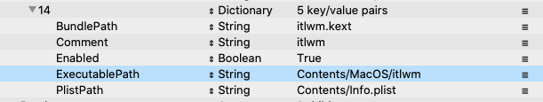

## 黑苹果穷折腾记
-----

### 1. 前言

从2019年开始我把用了4年的MacBookPro卖了换成了DELL游侠G3 3590作为我的主力办公电脑。

但是，在使用过程中Windows10自带的CMD命令行工具，简直难用到让人发指。

期间我也尝试用msys2、cygwin来缓解我的命令行焦虑，但是无解。

登录apple.com看了看MacBookPro的价格，再看看钱包里那几块钱，真下不了勇气换。

于是开始关注黑苹果。

### 2. 准备工作

从度娘上搜了搜，发现很多人说Intel的NUC8i5BEH可以达到90%无痛安装黑苹果，于是下定决心开始我的换果计划。

做事之前肯定要先做做功课才能让后面的步骤更顺利些。于是，我参考了下面部分文章

**黑果小兵的部落**
```html
网址
https://blog.daliansky.net/
github地址
https://github.com/daliansky
```

**程序小黑**

```html
https://gitee.com/wangdudyb/nuc8i5beh
```

**参考安装文档**

```html
https://www.jianshu.com/p/ebd6054d4799
```

### 2.1. 准备硬件

由于以前被某些第三方卖家坑过，所以这次所有硬件都在京东上买。

这里再怒赞京东的售后！退货、换货和处理纠纷那简直是一种上帝般的感觉！！！

|序号|硬件名称|硬件规格|数量|购买链接|价格|
|:---|---|---|----|---|---:|
|1|主机|NUC8i5BEH|1|https://item.jd.com/56753694658.html?cu=true|2499|
|2|内存|威刚DDR4-2666|2|https://item.jd.com/100000626474.html|379|
|3|硬盘|HPex950|1|https://item.jd.com/100002852562.html|799|
|4|免驱USB蓝牙|绿联USB蓝牙适配器|1|https://item.jd.com/3252898.html|39|
|5|优盘|任意品牌|32GB|-|-|

总价格： 2499+ 379*2+799+39 = 4095。

### 2.1.1. NUC BIOS版本

从别人的经验，NUC的BIOS版本从056~078都可以，我的这个NUC买的时候带的是077，确认可用。

安装黑苹果前需要修改如下几个配置

1. 关闭安全启动 (Secure Boot)
1. 开启 Legacy Boot
1. 关闭 Network Boot
1. 关闭 VT-D

详见配置可以参考如下文章

```html
https://www.jianshu.com/p/ebd6054d4799
```


### 2.2. 准备软件

除了准备硬件还需要准备软件，以下列出我用到的软件

1. NUC8i5BEH黑苹果专用安装盘。**私信我**
1. [镜像写盘工具Etcher](https://github.com/balena-io/etcher)
1. [config.plist修改工具ProperTree](http://blog.xjn819.com/wp-content/uploads/2019/10/ProperTree.zip)
1. [黑苹果工具箱Hackintool](http://headsoft.com.au/download/mac/Hackintool.zip)

参考大神的文章：

```html
https://blog.xjn819.com/?p=543
```

### 3. 安装注意事项：

请参考如下文章安装黑苹果

```html
https://www.jianshu.com/p/ebd6054d4799
```

安装过程非常顺利，但是还有一些事项需要特别注意。

### 3.1. Clover换成OpenCore

挂在EFI分区后，你可以在EFI分区所在目录中找到一个OC压缩包。

把这个包解压缩然后把解压缩出来的OC目录拷贝到EFI目录下(与BOOT同级)即可


### 3.2. 驱动声卡

起初，我参考如下文章想驱动我的机器的声卡，但是失败了。

不过不代表你的机器也失败，可以按照文章的内容尝试一下。

```html
https://blog.xjn819.com/?p=543
```
找到上面网址中的**2.0 Config.plist 修改**章节，找到**2.3.1  声卡**部分，按照说明依次替换Layout id尝试驱动声卡。

### 3.3. 使用蓝牙

最开始从网上看到很多人说无法驱动蓝牙。

所以，在京东上搜到了**绿联的USB蓝牙4.0模块**在苹果系统上是免驱的。所以，直接下单买了一个。懒得折腾了。

经过测试，确实是免驱，插上就认出来了。

我的QCY和BOSE 35蓝牙耳机都是可以链接。并且，听歌完全没有问题。

除了信号范围小(半径3米内)以外没毛病。

### 3.4. 驱动Wifi

默认情况下，虽然Intel的无线网卡在macOS上无法驱动。

但是github上已经有大神纯手撸了一个开源的无线网卡驱动。并且，里面也有中国大神。牛🐂

项目参考地址：

```html
驱动
https://github.com/OpenIntelWireless/itlwm
控制工具
https://github.com/OpenIntelWireless/HeliPort
```

**确认网卡型号**

Intel有一个特别好的网站[ark](https://ark.intel.com/content/www/us/en/ark/products/126148/intel-nuc-kit-nuc8i5beh.html) 

可以在这个网站上查询到所有硬件信息。找到**Intel® Wireless-AC**关键字，可以找到对应的网卡和蓝牙型号。我的NUC无线网卡型号为9560

在下面的页面查看你的NUC网卡是否在兼容列表中

```html
https://openintelwireless.github.io/itlwm/Compat.html
```

很显然，我的9560就是在支持列表中，并且驱动文件名称为itlwm.kext。**注意，一定要看准支持你的网卡的驱动名称**

上述步骤确认执行无误后，执行下面的步骤。

**安装驱动**

从驱动项目中下载最新的编译好的驱动包，兼容我的无线网卡的驱动包名称为itlwm_v1.0.0_stable.kext.zip

```html
https://github.com/OpenIntelWireless/itlwm/releases/download/v1.0.0/itlwm_v1.0.0_stable.kext.zip
```

下载完成后解压，会生成一个**itlwm_v1.0.0_stable.kext**，把名字改成**itlwm.kext**。方便后面修改config.plist文件。

**修改config.plist，添加无线网卡配置**

激活网卡就要修改config.plist文件，在这个文件中新加一组配置

步骤如下：

```bash
挂在EFI分区
$ sudo diskutil mount disk0s1
```

用ProperTree修改config.plist,在Kernel -> Add 下添加一组配置。可以参考已存在的配置

选中最后一个配置组名，比如11，然后Command + C复制，Command+V粘贴就拷贝了一个新的配置



**安装控制工具**

从以下网址下载无线控制工具HeliPort

```html
https://github.com/OpenIntelWireless/HeliPort/releases/download/v1.0.0/HeliPort.dmg
```

以上步骤做完以后，重启机器看看无线起来了吗。不过要注意**WPA Enterprise**协议不支持哦。
