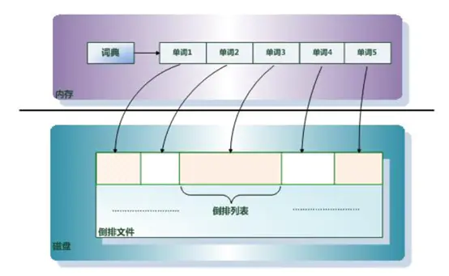
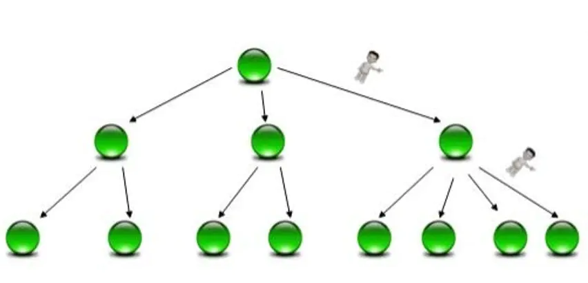

## 倒排索引
-----

### 1. 正排索引

正排索引也称为“前向索引”，它是创建倒排索引的基础。

正排索引是基于文档建立的。

正排索引适合根据文档id来查询对应的文档内容。但是在查询一个keyword在哪些文档中包含的时候需对所有的文档进行扫描以确保没有遗漏。

这样就使得检索时间大大延长，检索效率低下。

正排索引结果示意图：

|文档ID| 文档内容|
|:---|---:|
|1|Elasticsearch是最流行的搜索引擎|
|2|php是世界上最好的语言|
|3|搜索引擎是如何诞生的|

### 1.1.  正排索引的维护

当有新的文档加入，直接为该文档建立一个新的索引块，挂接在原来索引文件的后面。

如果有文档被删除，则直接知道该文档号对应的索引信息，将其直接删除。

### 1.2. 正排索引的特点

优点： 工作原理非常的简单

缺点： 检索效率非常低，只能在简单的场景下使用。

### 2. 倒排索引

在搜索引擎中每个文档都对应一个文件ID，文件内容表示为一系列关键词（去除无用词后）的集合。

例如： 上面文档中的的文档ID为1的内容经过分词，提取了3个关键词，每个关键词都会记录它所在文档中的出现频率及出现位置。

可以到倒排索引的内容

|单词| 文档ID列表|
|:---|---:|
|Elasticsearch| 1|
|流行| 1|
|搜索引擎|1，3|
|php| 2|
|世界| 2|
|最好| 2|
|语言|2|
|如何|3|
|诞生|3|

### 2.1. 查询方法

首先通过倒排索引可以查询到“搜索引擎”该关键词出现的文档位置是在文档1和3中，然后再通过正排索引查询到文档1和3的内容并返回。

### 2.2. 倒排索引的组成

倒排索引主要由单词词典(Term Directory)、倒排列表(Posting List)和倒排文件(Inverted File)组成。



#### 单词词典(Term Directory)：

搜索引擎的通常索引单位是单词,单词词典是由文档集合中出现过的所有单词构成的字符串集合。

单词词典内每条索引项记载单词本身的一些信息以及指向“倒排列表”的指针。

#### 倒排列表(Posting List)

倒排列表记载了出现过某个单词的所有文档的文档列表及单词在该文档中出现的位置信息及频率(作关联性算分)。

每条记录称为一个倒排项(Posting)，根据倒排列表即可以获知哪些文档包含某个单词。

#### 倒排文件(Inverted List)

所有单词的倒排列表往往顺序地存储在磁盘的某个文件里，这个文件即被成为倒排文件，倒排文件是存储倒排索引的物理文件。

以查找“搜索引擎”关键字为例

|文档ID| 文档内容|
 |:---|---:|
 |1|Elasticsearch是最流行的搜索引擎|
 |2|php是世界上最好的语言|
 |3|搜索引擎是如何诞生的|
 
 可得到此关键字的倒排索引
 
|DocId| TF| Position| Offset|
|:---|---|---|---:|
|1|1|2|<18,22>|
|3|1|0|<0,4>|

### 3. 单词词典查询定位问题

对于一些规模很大的文档集合来说，它里面可能包含了上百万的关键单词（term），能否快速定位到估计单词(term)，会直接影响到相应速度。

假设有如下单词

```text
Carla, Sara, Elin, Ada, Patty, Kate, Selena
```

如果按照这样的顺序排列，找出某个特定的term一定很慢。因为term没有排序，需要全部过滤一遍才能找到特定的term，排序后就变成了

```text
Ada, Carla, Elink, Kate, Patty, Sara, Selena
```

排序后就可以使用二分查找方式，比全遍历更快地找出目标的term。这就是term dirtionary。

有了term directory后，可以用LogN次磁盘查找得到目标。

但是磁盘的随机读操作仍然是非常慢的，所以尽量少的读磁盘。有必要把一些数据缓存到内存中。

但是整个term dirtionary本身又太大，无法完整地放在内存中。于是就有了term index，term index有点像一本字典的大的章节表。

目前常用的方式是通过hash加链表结构和属性结构（b树或者b+树）

### 3.1. Hash加链表的结构


这种方式可以快速计算单词的hash值从而定位到它所在的hash表中，如果该表又是一个链表结构，那么就需要遍历这个链表然后再对比返回结果。

这种方式的最大缺点就是如果又范围查询就很难做到。

### 3.2. 树形结构

B树(或者B+树)是另外一种搞笑查找结构。

B树与哈希方式查找不同，需要字典项能否按照大小排序(数字或者字符序)，而哈希方式则无需数据满足此项要求。

B树形成了层级查找结构，中间节点用于指出一定顺序范围的词典项存储再哪个子树中，起到根据词典项比较大小进行导航的作用。

B树最底层的叶子节点存储单词的地址信息，根据这个地址就可以提取出单词字符串。

