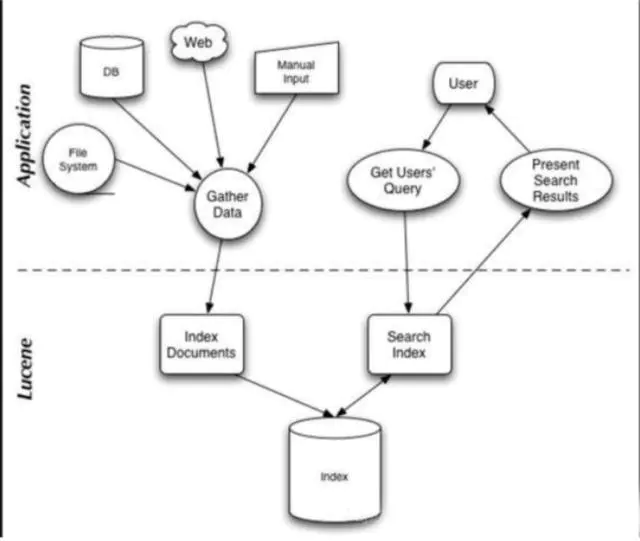

## Elasticsearch 

-----

### Elasticsearch的典型应用场景

应用场景：

1. 订单搜索
1. 商品推荐
1. 日志管理
1. IT运维
1. 风险控制
1. 安全监控
1. 坐标数据

### 1. Elasticsearch了解多少?说说你们公司ES的集群架构，索引数据大小分片多少？调优手段

比如： 

1. ES集群架构13个节点索引根据通道不同共20+索引。
1. 根据日期，每日递增20+。
1. 索引是10分片，每日递增一亿+数据。
1. 每个通道每天索引大小控制在150GB以内。

仅索引层面调优手段：

### 1.1. 设计阶段调优

根据业务增量需求，采取基于日期模板创建索引。通过roll over API滚动索引。

使用别名进行索引管理。

每天凌晨定时对索引做force_merge操作，释放空间。

采取冷热分离机制，热数据存储到SSD上，以提高检索效率；冷数据定期进行shrink操作，以缩减存储。

采取curator进行索引的声明周期管理。

仅针对需要分词的字段合理设置分词器。

Mapping阶段充分结合各个字段的属性，设定是否需要检索、是否需要存储等。

### 1.2. 写入调优

写入前副本数设置为0

写入前关闭refresh_interval设置为-1，禁用刷新机制

写入过程中采取Bulk批量写入

写入后恢复副本数和刷新间隔

尽量使用自动生成的id

### 1.3. 查询调优

禁用wildcard

禁用批量terms（成百上千的场景）

充分利用倒排索引机制，能keyword类型尽量keyword

数据量大的时候，可以先基于时间敲定索引再检索

设置合理的路由机制

### 1.4. 其他调优

部署调优、业务调优等

### 2. Elasticsearch到倒排索引是什么

传统的检索是通过文章，逐个遍历找到对应关键词的位置。

而倒排索引是通过分词策略，形成了词和文章的映射关系表。这种词典+映射表即为倒排索引。

有了倒排索引就能实现o(1)时间复杂度的效率检索文章了。极大的提高了检索效率。

更学术的解答方式：

倒排索引，相反于一篇文章包含了哪些词，它从词出发，记载了这个词再哪些文章中出现过。

倒排索引由两部分组成： 词典和倒排表

倒排索引底层实现基于FST（Finite State Transducer）数据结构

Lucene从4+班恩开始大量使用的数据结构就是FST，此种数据结构有两个优点：

1. 空间占用小。通过对词典中单词前缀和后缀的重复使用，压缩了存储空间。
1. 查询速度快。 O(len(str))的查询时间复杂度。


### 3. Elasticsearch索引数据多了怎么办？如何调优和部署。

索引数据的规划应该在前期做好规划，正所谓“设计先行、编码在后”。

这样才能有效的避免突如其来的数据激增导致集群处理能力不足引发的线上性能问题。

### 3.1. 动态索引层面

基于模板+时间+rollover API滚动创建索引。

例如：

blog索引的模板格式为： blog_index_时间戳的形式，每天递增数据。

这样做的好处是不至于数据量激增导致单个索引数据量非常大，接近于上线2的32次幂-1，索引存储达到了TB+甚至更大。

一旦单个索引很大，存储等各种风险也随之而来，所以要提前考虑，及早避免。

### 3.2. 存储层面

冷热数据分离存储。热数据可以是最近3天或1周的数据，其余为冷数据。

对于冷数据不会再写入新数据，可以考虑定期force_merge加shrink压缩，节省存储空间和提高检索效率。

### 3.3. 部署层面

结合ES自身的支持动态扩展的特点，动态新增机器的方式可以缓解集群压力。注意：如果之前主节点规划合理，不需要重启集群也能动态增加节点。

### 4. Elasticsearch是如何实现Master选举的

master节点的职责主要包括集群、节点和索引的管理。不负责文档级别的管理；data节点可以关闭http功能。

选举前提：

1. 只有候选主节点（master: true）才能成为主节点。
1. 最小主节点数(min_master_nodes)的目的是防止脑裂。

选举流程大致如下：

1.确认候选主节点数达标。elasticsearch.yml设置的值

```txt
discovery.zen.minimum_master_nodes
```

2.先判定是否具备master资格，具备候选主节点资格的有限返回。

如果有多个符合资格的候选主节点，则节点id值小的会成为主节点。

获取节点id值的方法是

```html
GET _cat/nodes?v&h=ip,port,heapPercent,heapMax,id,name
```

选举过程：

1. Elasticsearch的选主时ZenDiscovery模块负责的。主要包含Ping(节点间发现彼此)和Unicast(单播模块包含一个主机列表以控制哪些节点需要ping通)这两个部分
1. 对所有可以成为Master的节点(node.master = true)根绝节点的id字典排序，每次选举每个节点都把自己所知道节点排一次序，然后选出第一个(第0位)节点，暂且认为他是master节点。
1. 如果对某个节点的投票数达到了一定的值(master = n/2 +1)，并且该节点自己也选举自己，那么这个节点就是master。否则重新选举。


### 5. 描述Elasticsearch索引文档的写入过程

1.客户端向集群某节点写入数据，发送写入请求。如果没有指定路由/协调节点,请求的节点扮演路由节点的角色。

2.节点1接受到请求后使用文档_id来确定文档属于哪个分片。假设节点3保存分片0，则分片0的主分片分配到节点3上。

3.节点3再主分片上执行写入操作。如果写入成功，则将请求并行转发到节点1和节点2的副本分片上，等待其执行结果。

4.当所有副本分片都报告写入成功，节点3将向协调节点，也就是节点1报告写入成功，节点1把写入装太返回给客户端。

文档可以通过路由算法获取分片位置，路由算法就是根据路由和文档id计算目标的分片id的过程：

```text
1shard = hash(_routing) % (num_of_primary_shards)
```

### 6. 描述一下Elasticsearch搜索的过程

通常搜索可以拆解为Query和Fetch两个阶段。

Query阶段的目的：定位到位置，但是不负责取数据。

Query步骤拆解如下：

1. 假设一个索引数据有5主+1副本共10分片，一次请求会命中主或者副本分片中的一个。
1. 每个分片在本地进行查询，结果返回到本地有序的有限队列中。
1. 步骤2节点发送到协调节点，协调节点产生一个全局的排序列表。

Fetch阶段的目的：获取数据。

### 7. Elaticsearch在部署时，对Linux的设置有哪些优化方法

1. 64GB内存的机器是非常理想的，但是32GB或者16GB的机器（虚拟机）也很常见。ES_HEAP_SIZE最好是物理内存的一半，不要超过32GB。
1. 选择高主频+更多核的CPU；核心数指标要高于主频指标。
1. 通过设置gateway.recover_after_nodes、gateway.expected_nodes、gateway.recover_after_time可以在集群重启的时候尽可能避免过多的分片交换，大大缩短数据恢复时间。
1. Elasticsearch最好使用单播代替组播。
1. 关闭缓存swap
1. 堆内存设置为Min(节点内存/2，32GB)。
1. 设置最大文件句柄数。推荐设置为65535.
1. 线程池+队列大小根据业务需要调整。
1. 使用SSD代替机械硬盘。
1. 磁盘存储RAID可以采用RAID10。
1. 段和合并。Elasticsearch默认是20MB/s，如果使用SSD，加大到200-300MB/s。index.translog.flush_threshold_size设置尽可能大些，比如1GB，减少日志文件的频繁变更。
1. 如果你的搜索结果不需要近实时的准确度。考虑把每个索引的index.refresh_interval改到30s。
1. 如果在做大批量插入数据的操作。可以关闭副本index.number_of_replicas = 0。

### 8. Lucence的内部结构时什么



### 9. 对于GC，使用Elasticsearch需要注意的内容

1. 倒排词典的索引需要常驻内存，无法GC。需要监控data Node上segmentmemory增长的趋势
1. 各类缓存： field cache/filter cache/indexing cache/bulk queue等，要设置合理的大小。并且要时刻监控Heap的情况，确认是否够用。
1. 避免返回大量结果集的搜索和聚合。如果必须返回则采用scan && scroll api的方式实现。
1. Cluster Stats驻留内存无法水平扩展，超大规模集群可以考虑拆分成多个集群，然后通过tribe node来连接。
1. 时刻监控heap使用情况
1. 根据监控数据理解内存需求，合理配置各类circuit breaker，将内存溢出风险降到最低。

### 10. Elasticsearch对于大数据量（上亿）的聚合如何实现

Elastcisearch提供的首个近似聚合是Cardinality度量。

它提供一个字段的技术，即该字段的distinct或者unique值的数目。

它是基于HLL算法的。HLL会先对我们的输入做哈希运算，然后根据哈希运算的结果中的bits做概率估算而得到基数。

HLL特点：
1. 可配置的精度，用来控制内存的使用。更精确=更多内存
1. 小的数据集精度是非常高的。
1. 可以通过配置参数设置去重需要的固定内存使用量。无论数据量是几千还是几亿，内存使用量只与你配置的精度有关。

### 11. 在并发情况下，Elasticsearch如何保证读写一致。

可以通过版本号使用乐观锁并发控制。以确保新版本不会被旧版本覆盖，由应用层来处理具体的冲突。

另外对于写操作，一致性级别支持quorum/one/all，默认为quorum，即只有当大多数分片可用时才允许写操作。但即使大多数可用，也可能存在因为网络等原因导致写入副本失败，这样该副本被认为故障。分片将会在一个不同的节点上重建。

对于读操作，可以设置replication 为sync（默认）。这使得操作在主分片和副本分片都完成后才会返回。如果设置成replication为async，也可以通过设置搜索请求参数_preference为primary来查询主分片，确保文档是最新的。

### 参考资料

```html
https://www.jianshu.com/p/ad71c7518d58
```